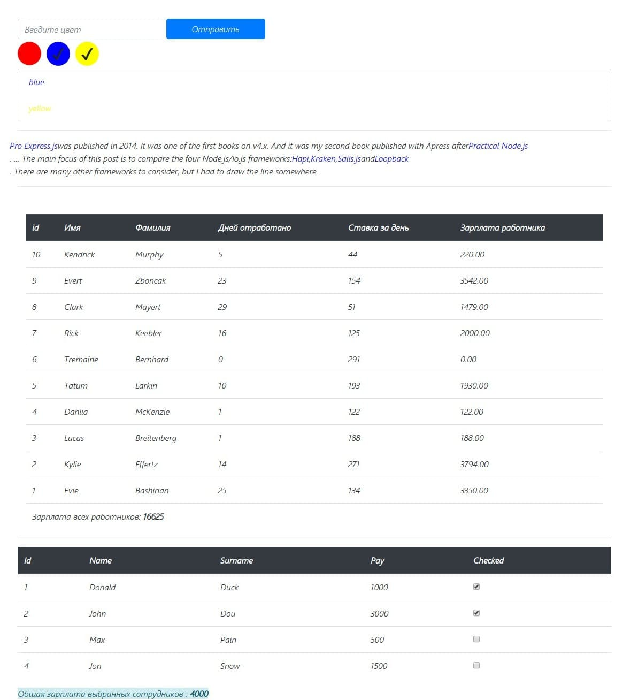

# React TypeScript example

It is simple code example TypeScript in React.js
I don't use Router, Redux or other library, only react and TS.

If you want to start the project, install build configuration [react-create-app](https://github.com/facebook/create-react-app "react-create-app") and run ***npm install*** for install all dependence

